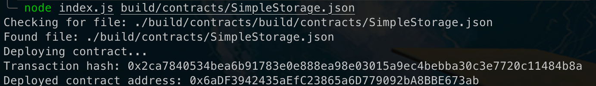

# Deploy a Simple Ethereum Smart Contract on Polyjuice
---
## 1) Screenshot of Console Output

---
## 2) Transaction Hash of Contract Deployment
### `0x2ca7840534bea6b91783e0e888ea98e03015a9ec4bebba30c3e7720c11484b8a`
---
## 3) Address of Deployed Contract
### `0x6aDF3942435aEfC23865a6D779092bA8BBE673ab`
