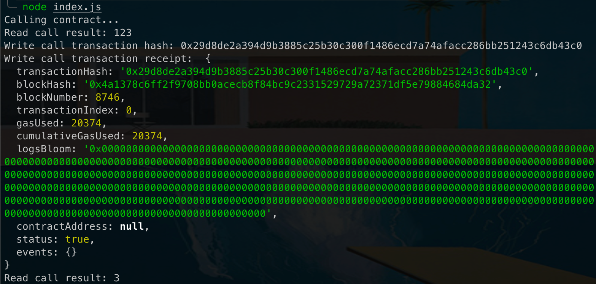

Issue a Smart Contract Call to the Deployed Smart Contract
---
## 1) Screenshot of Console Output

---
## 2) Transaction Hash in Text form
### `0x29d8de2a394d9b3885c25b30c300f1486ecd7a74afacc286bb251243c6db43c0`
---
## 3) Contract Address
### `0x6aDF3942435aEfC23865a6D779092bA8BBE673ab`
---
## 4) ABI For Deployed Contract
`[{"inputs": [], "stateMutability": "payable", "type": "constructor"},
      {"inputs": [{"internalType": "uint256", "name": "x", "type": "uint256"}], "name": "set", "o      utputs": [], "stateMutability": "payable", "type": "function"}, {"inputs": [], "name": "get      ", "outputs": [{"internalType": "uint256", "name": "", "type": "uint256"}], "stateMutabilit      y": "view", "type": "function"}]`
