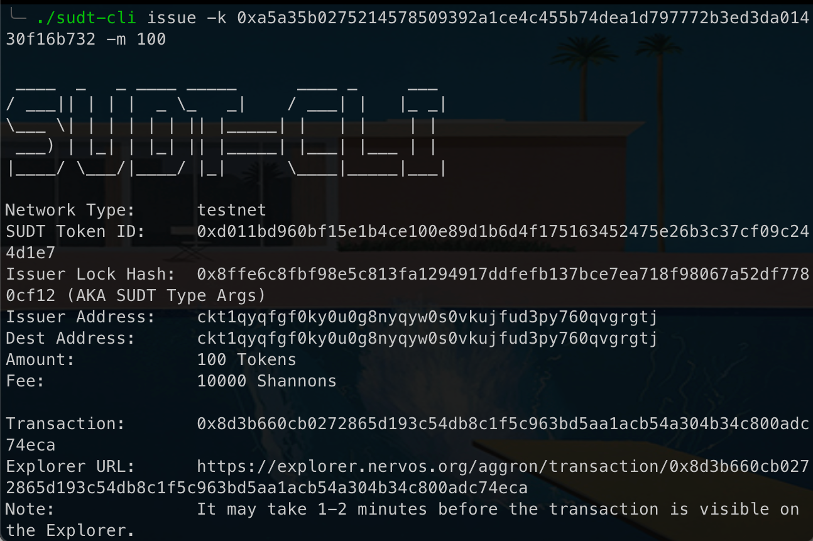

# Issue an SUDT Token on Layer 1 and Deposit it to Layer 2
---
## 1) Link to layer 1 address
[Address on Block Explorer](https://explorer.nervos.org/aggron/address/ckt1qyqfgf0ky0u0g8nyqyw0s0vkujfud3py760qvgrgtj)
---
## 2) Screen capture of sudt-cli output

---
## 3) Link to transaction id
[Transaction Id on Block Explorer](https://explorer.nervos.org/aggron/transaction/0x8d3b660cb0272865d193c54db8c1f5c963bd5aa1acb54a304b34c800adc74eca)

