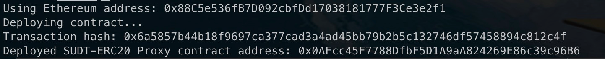
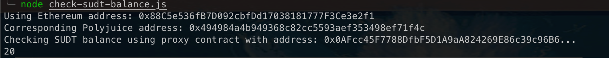
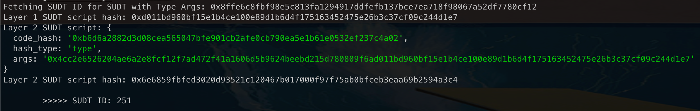

# Deploy the ERC20 Proxy Contract for the Deposited SUDT
---
## 1) Screen Capture of proxy contract deployment

---
## 2) Address of ERC-20 Proxy Contract 
``
``
---
## 3) Screen Capture of SUDT balance

---
## 4) Ethereum Address
``
``
---
## Bonus: Get Layer 2 SUDT

